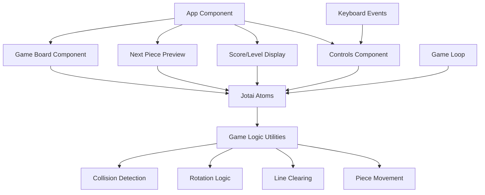
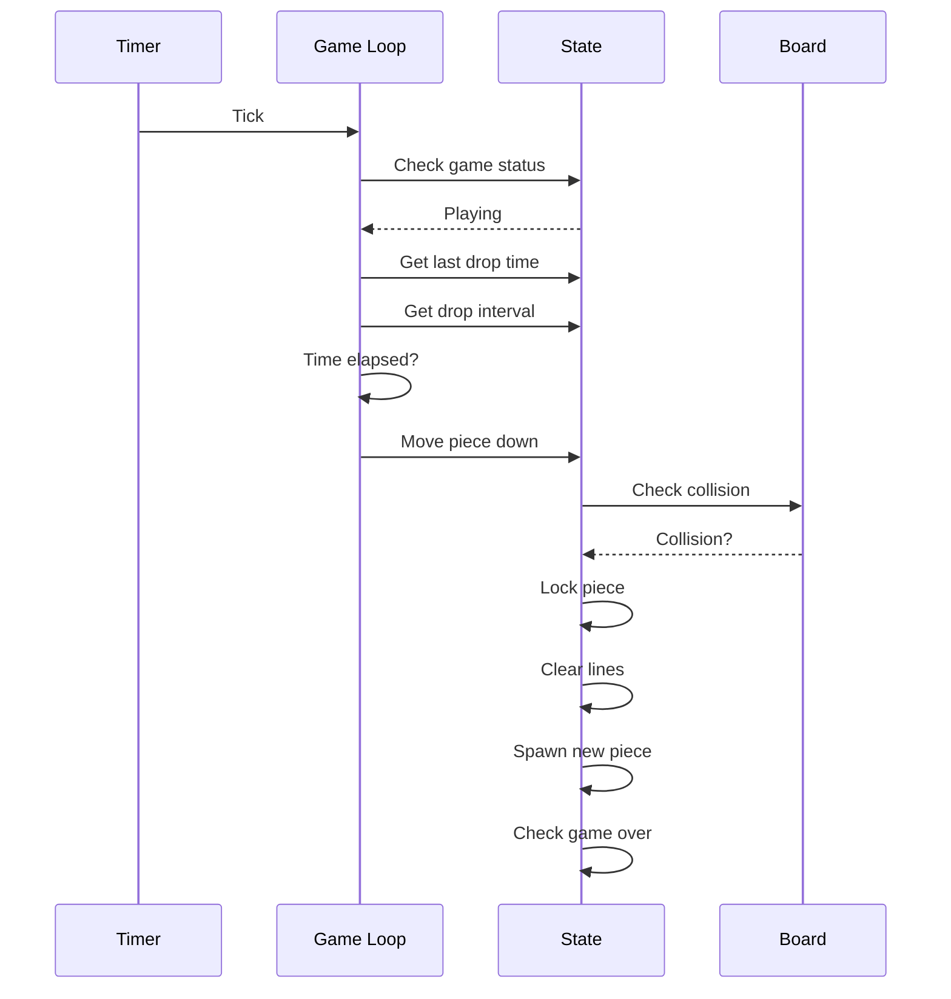

# Tetris Game Architecture Plan

## Overview
A complete Tetris game implementation using React, Jotai for state management, and Tailwindcss for styling.

## System Architecture



## State Management (Jotai Atoms)

### Core Game State
- **boardAtom**: 10x20 grid representing the game board
- **currentPieceAtom**: Currently falling piece (shape, position, rotation)
- **nextPieceAtom**: Next piece to spawn
- **gameStatusAtom**: 'idle' | 'playing' | 'paused' | 'gameover'

### Scoring State
- **scoreAtom**: Current score
- **levelAtom**: Current level (affects drop speed)
- **linesAtom**: Total lines cleared

### Timing State
- **lastDropTimeAtom**: Timestamp of last piece drop
- **dropIntervalAtom**: Time between automatic drops (decreases with level)

## Tetromino Shapes

Standard 7 tetromino shapes with colors:

1. **I-piece**: Cyan - 4x1 line
2. **O-piece**: Yellow - 2x2 square
3. **T-piece**: Purple - T-shape
4. **S-piece**: Green - S-shape
5. **Z-piece**: Red - Z-shape
6. **J-piece**: Blue - J-shape
7. **L-piece**: Orange - L-shape

## Game Logic Functions

### Collision Detection
- Check if piece position is valid within bounds
- Check if piece collides with existing blocks on board

### Rotation
- Rotate piece 90 degrees clockwise
- Apply wall kicks if rotation causes collision

### Movement
- Move piece left/right/down
- Hard drop (instant to bottom)
- Soft drop (accelerated fall)

### Line Clearing
- Detect completed rows
- Remove filled rows
- Move remaining rows down
- Update score based on lines cleared

### Spawning
- Generate new piece at top center
- Check for game over (spawn collision)

## Component Structure

### App Component
- Main container with Tailwind layout
- Coordinates all game components
- Handles keyboard input

### Game Board Component
- Renders 10x20 grid
- Displays locked pieces and current piece
- Uses Tailwind grid layout

### Next Piece Preview
- Shows upcoming piece
- 4x4 preview grid

### Score Display
- Shows current score, level, lines
- Styled with Tailwind

### Controls Component
- Start/Pause/Restart buttons
- Mobile-friendly controls (optional)

## Game Loop



## Keyboard Controls

- **Arrow Left/Right**: Move piece horizontally
- **Arrow Down**: Soft drop (accelerated)
- **Arrow Up**: Rotate piece
- **Space**: Hard drop (instant)
- **P**: Pause/Resume
- **R**: Restart game

## Scoring System

Standard Tetris scoring:
- 1 line: 100 points × level
- 2 lines: 300 points × level
- 3 lines: 500 points × level
- 4 lines (Tetris): 800 points × level

Level increases every 10 lines cleared.

## File Structure

```
src/
├── atoms/
│   ├── boardAtom.ts
│   ├── currentPieceAtom.ts
│   ├── nextPieceAtom.ts
│   ├── gameStatusAtom.ts
│   ├── scoreAtom.ts
│   └── gameLoopAtom.ts
├── utils/
│   ├── tetrominos.ts
│   ├── collision.ts
│   ├── rotation.ts
│   ├── lineClearing.ts
│   └── movement.ts
├── components/
│   ├── GameBoard.tsx
│   ├── NextPiece.tsx
│   ├── ScoreDisplay.tsx
│   └── Controls.tsx
├── App.tsx
└── main.tsx
```

## Tailwind Styling Approach

- Use grid layout for game board (10 columns, 20 rows)
- Flexbox for overall layout
- Color classes for tetromino blocks
- Responsive design considerations
- Dark theme with neon-style colors

## Implementation Priority

1. Set up Jotai atoms for state management
2. Define tetromino shapes and colors
3. Implement core game logic utilities
4. Create game board component
5. Add piece movement and controls
6. Implement game loop
7. Add scoring and level system
8. Style with Tailwindcss
9. Add game over and pause functionality
10. Polish and test